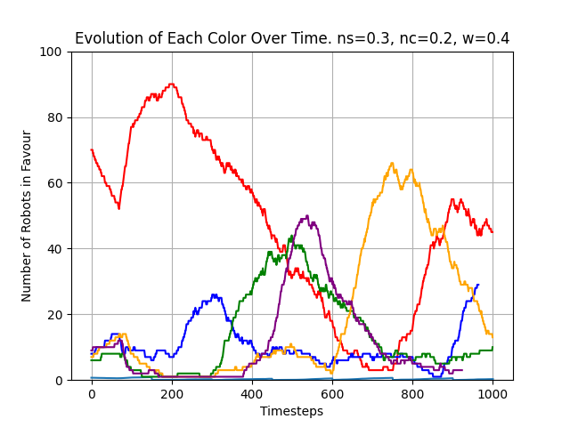
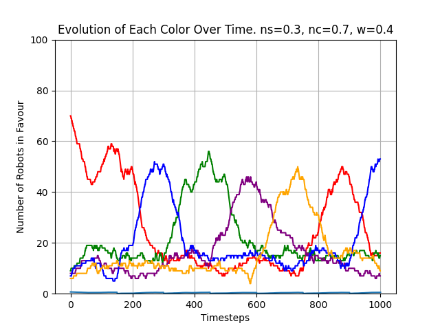

## Findings

#### Effects of Communication Noise
In low communication noise (20%) we see decision making is difficult in a dynamic
environment. 

With increased communication noise, we see some decision making happening
